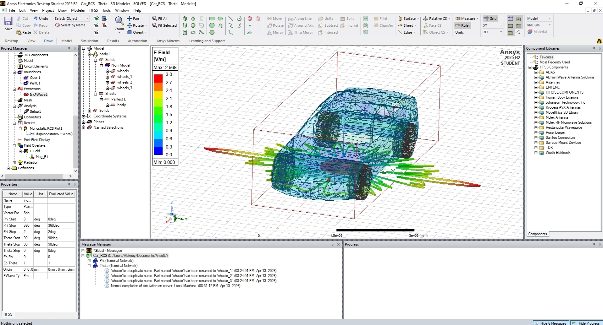
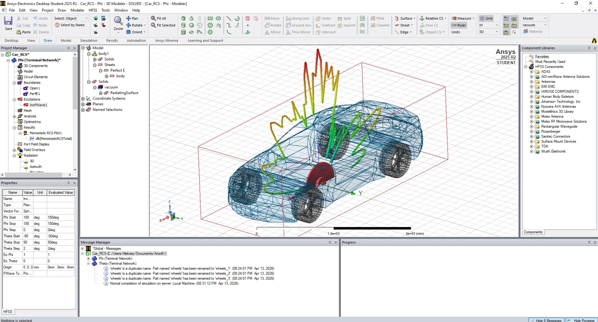
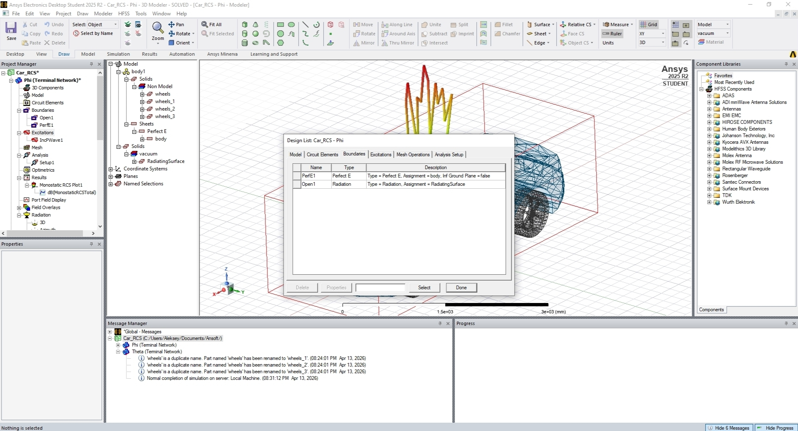
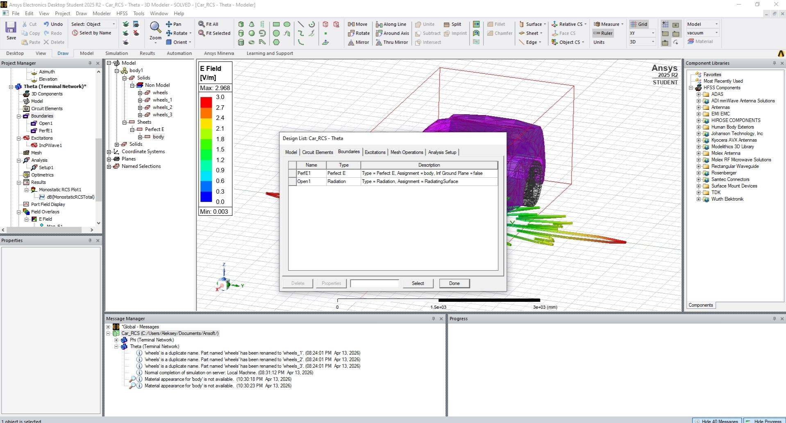
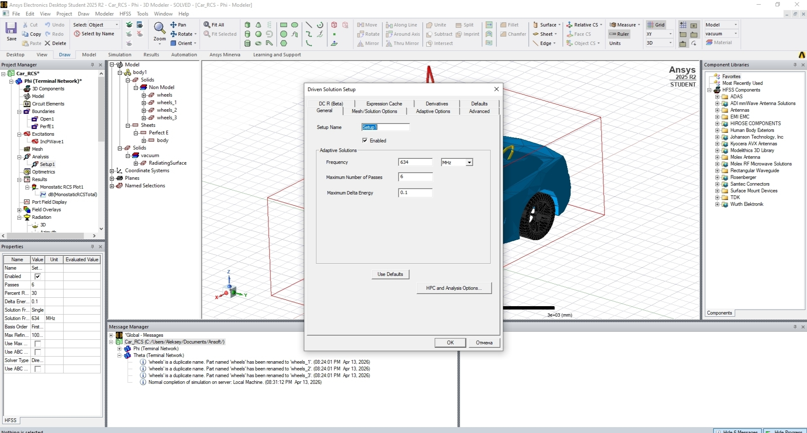
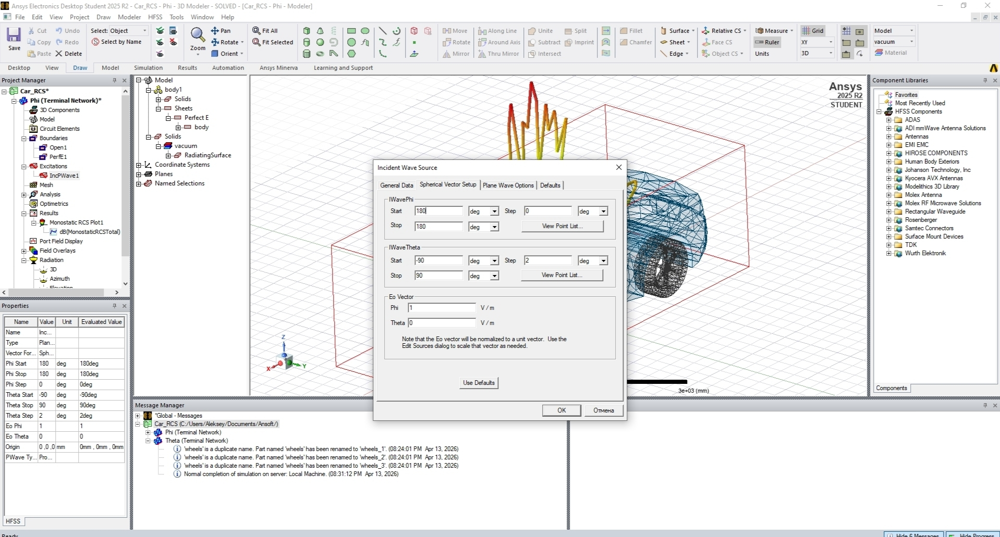
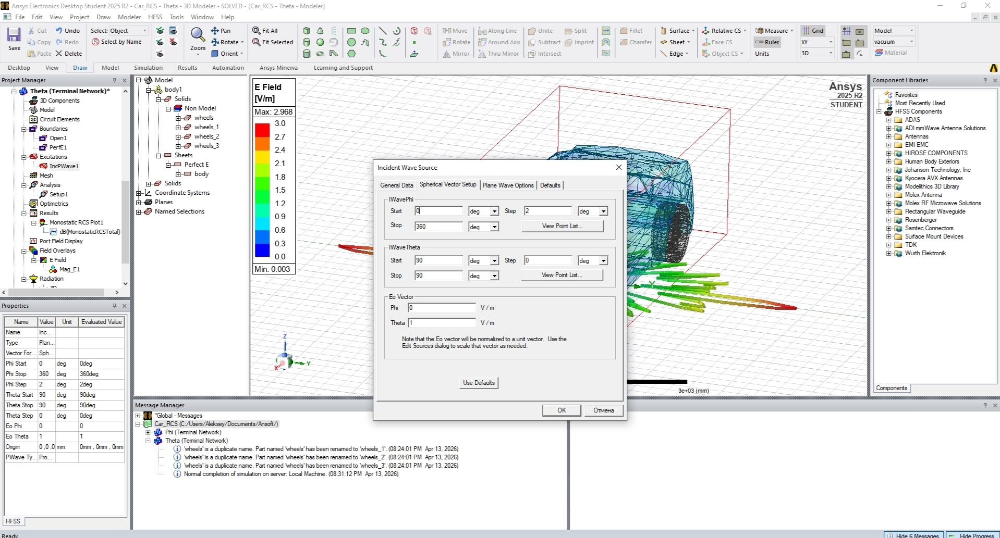
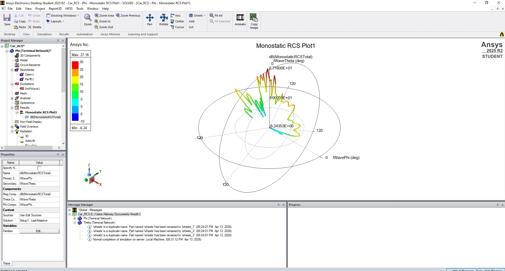
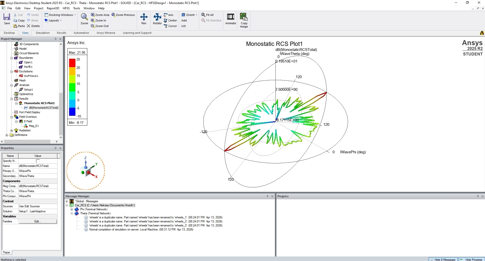

# Ovsyannikov_RCS_car
Расчёт ЭПР автомобиля в Ansys HFSS
Скачать файл: [Car_RCS.aedtz](https://drive.google.com/file/d/1oZLzUxTX3-sx4whSPHos_N8fktx1YvrG/view?usp=sharing)
# Отчёт по заданию к лекции №4 «Создание электродинамических моделей»
## по дисциплине «Цифровые двойники»

**Выполнил:** студент гр. РИ-151121 Овсянников А. И.  
**Проверил:** преподаватель Денисов Д. В.  

**Екатеринбург 2026**

---

## Методы расчёта антенн в HFSS

| Метод | Суть | Особенности |
| :--- | :--- | :--- |
| **FEM** (Метод конечных элементов) | Расчёт полей в объёме (3D-сетка) | Требует граничных условий: Radiation, PML, FE-BI. Поля ближней зоны имеют точный физический масштаб. Поля дальней зоны рассчитываются интегрированием на Radiation Surface. Подходит для установки антенн на объектах, учёта влияния проводящих поверхностей. |
| **IE** (Метод интегральных уравнений) | Расчёт токов и полей на поверхности объектов с использованием 2D-сетки | Не требует границ излучения (Radiation boundary), подходит для открытых задач (установка антенн на объектах). Поля в ближней и дальней зоне рассчитываются на расстоянии от элементов сетки. Не требует построения сетки в объёме. |
| **SBR+** (Shooting and Bouncing Rays – Лучевой метод) | Рассчитывает распространение лучей и растекание токов по поверхностям | Идеален для больших электрических размеров (крупные отражатели, крупноразмерные рефлекторы). |
| **FE-BI** (Finite Element-Boundary Integral) | Область FEM окружается границей, через которую поля передаются интегральным методом | Используется для возбуждения удалённых объектов. Позволяет передавать поля за пределы области FEM-анализа. |

### Гибридные комбинации
- Антенна Грегори

---

## Скриншоты с постановкой задачи

---

## Граничные условия

---

## Настройки частоты, источника излучения

---

## Теоретическая информация: ЭПР (RCS)

**ЭПР (эффективная площадь рассеяния, RCS — Radar Cross Section)** — это радиотехническая характеристика объекта, определяющая его способность рассеивать электромагнитные волны радара обратно к приёмнику.

Она представляет собой площадь эквивалентной изотропной поверхности, которая отражает столько же мощности, сколько реальный объект в направлении радара. Измеряется в квадратных метрах (м²) или в логарифмических единицах dBsm (децибелы относительно 1 м²).

ЭПР зависит от:
- формы объекта
- его материалов
- частоты радара
- угла облучения и ориентации цели

Для простых геометрических тел (сфера, цилиндр) она рассчитывается аналитически, но для сложных объектов требуется моделирование.

**Что даёт ЭПР:**
- Показывает радиолокационную заметность: высокая ЭПР → легкое обнаружение на больших дистанциях, низкая → stealth-свойства.
- В уравнении радара ЭПР напрямую влияет на максимальную дальность обнаружения.
- Раскрывает влияние формы, размеров, материалов объекта, а также его ориентации относительно радара и поляризации волн.
- Позволяет анализировать, как меняется рассеяние в зависимости от ракурса обзора или частоты сигнала.

**Измерения ЭПР дают:**
- Угловую диаграмму рассеяния
- Координаты локальных центров отражения (например, углы, торцы)
- Спектральные характеристики в широкой полосе частот

Такие данные помогают в моделировании поведения объекта и распознавании его типа.

---

## Диаграммы рассеяния ЭМ волны на автомобиле

### Вертикальная плоскость

### Горизонтальная плоскость

---

## Файл Ansys (.aedtz)

Файл проекта `Car_RCS.aedtz` слишком большой для GitHub (2.8 ГБ), поэтому загружен на Google Диск:

[📥 Скачать Car_RCS.aedtz](Car_RCS.aedtz](https://drive.google.com/file/d/1oZLzUxTX3-sx4whSPHos_N8fktx1YvrG/view?usp=sharing)

---

## Ссылка на репозиторий

[https://github.com/aleksejovsannikov997-lab/Ovsyannikov_RCS_car](https://github.com/aleksejovsannikov997-lab/Ovsyannikov_RCS_car)
